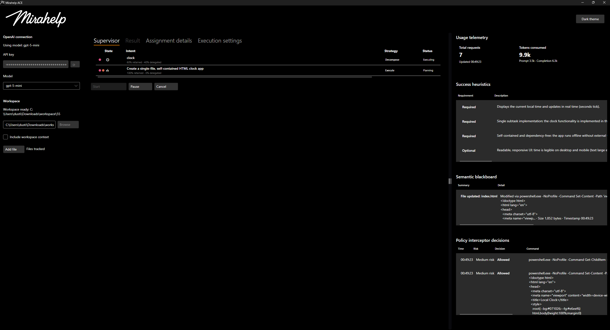
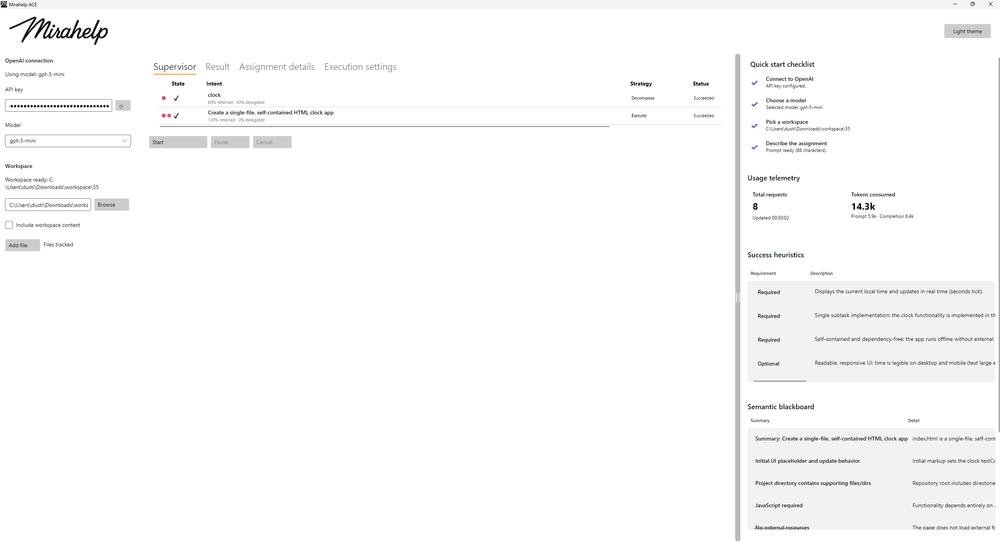

#  ACE

# Showcase
   

# Description
A desktop research environment built with Avalonia and .NET 10. It attempts to offers a fire and forget self-healing environment for research purposes.

# Highlights
- Schedule tasks
- Context sharing
- Work delegation
- Tolerance policy
- Repair attempts
- Usage dashboard, 
- Dark and light theme toggle

# Quick Start
- Requirements
	- Windows 10/11
	- .NET 10 SDK
	- OpenAI API key configured

[Releases](../../releases)

# Usage
- Follow the quick start tips inside the application
- This application requires an OpenAI key for usage. You are responsible for monitoring usage and costs. Carefully read the startup information inside the software tool.

# Localization
- Place compiled `.mo` files at:
	- `Locales/<culture>/LC_MESSAGES/ui.mo`  
	    Example: `Locales/en_US/LC_MESSAGES/ui.mo`
- The app uses the system UI culture if available, otherwise falls back to `en_US`.

# Notes
- Currently only supports Microsoft Windows.
- No telemetry. 
- All history is in memory.

# Roadmap
- Cross-platform support.
- Expanded approval workflows

# Contributing
PRs are welcome.

# License
See `LICENSE`.
